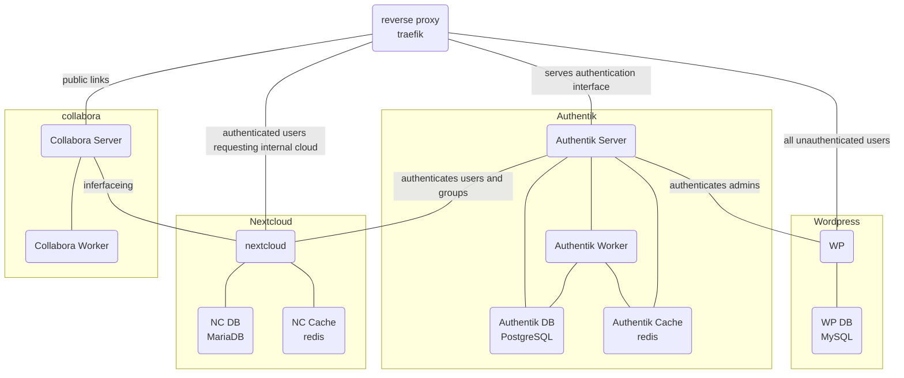

# Architecture

```mermaid
flowchart TB

    proxy(reverse proxy <br> traefik)

    subgraph Wordpress
        wp(WP) --- wpdb(WP DB <br> MySQL)
    end
    subgraph Authentik
        auth(Authentik Server) --- authdb(Authentik DB <br> PostgreSQL)
        auth ---authwork(Authentik Worker)
        authwork --- authcache
        auth --- authcache(Authentik Cache <br> redis)
        authwork --- authdb
    end

    subgraph Nextcloud
        nc(nextcloud) --- ncdb(NC DB <br>MariaDB)
        nc --- nccache(NC Cache <br> redis)
    end

    subgraph collabora
        cb(Collabora Server) --- cbworker(Collabora Worker)
    end

    auth -- authenticates admins --- wp
    proxy --all unauthenticated users --- wp
    proxy --serves authentication interface--- auth
    proxy --authenticated users requesting internal cloud--- nc
    proxy -- public links --- cb

    auth --authenticates users and groups --- nc
    cb -- inferfaceing --- nc

```
