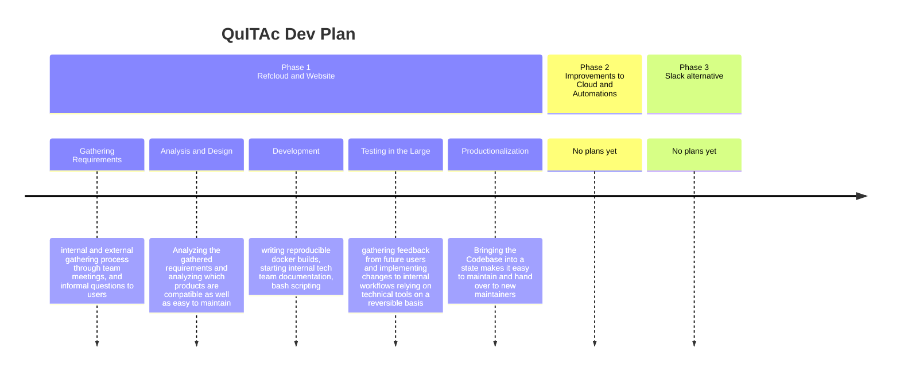
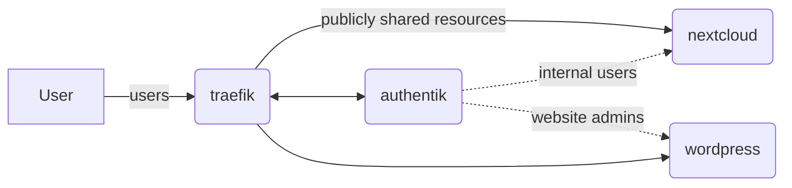

# Development Plan

QuITAc decided to structure the development of the Queerreferats digital resources.
The following graph shows the subphases or steps per phase

We are currently in phase 1, sub-phase 3 (development).
In subphase 1 we have gathered the following feedback externally and internally:

* SSO solution
* new Website with user-friendly backend
* Cloud including Groupware
* Data security and privacy
* Extensibility

This can be translated to the following technical requiments

* FOSS where possible
* Reproducability and automation where possible
* good documentation
* Multistage backups
* build with extending the feature set in future in mind
* using well-maintained products

This has led us to the following design decisions in subphase 2:

* Hosting on. Hetzner
* well-liked
* works with docker even behind virtualization
* fair prizes
* need data addendum to our data agreements with users (negative, but manageable)
* Cloud based on Nextcloud
* Easy to integrate/ ready-made groupware and add-ons
* supports common sso standards
* self-hostable
* SSO by Authentik
* integrates well with nextcloud
* new, stylish and covers a lot of technical cases
* user-friendly interface included, but also scriptable/configurable through cli
* Traefik Reverse Proxy
  * ingenious integration into docker
* well-maintained, well-liked
* secure
* integrates well with authentik as path authenticator
* Wordpress for Website
* old-ish design, php-based (negative point)
* best supported FOSS CMS
* easy to use user-wise
* good extensive documentation
* plethora of themes, workable for us to translate external themes (ivana)

We can therefore project the following base architecture on hetzner servers:

